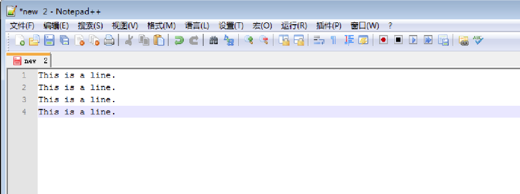
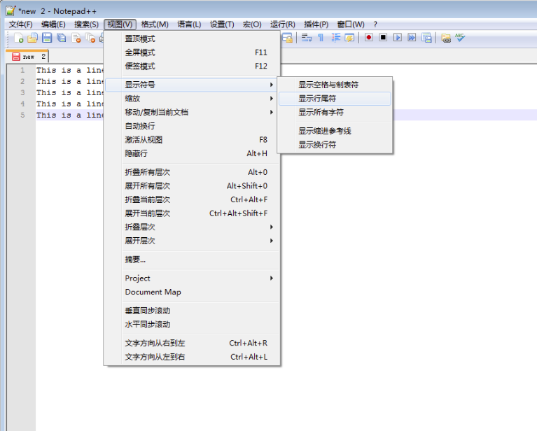
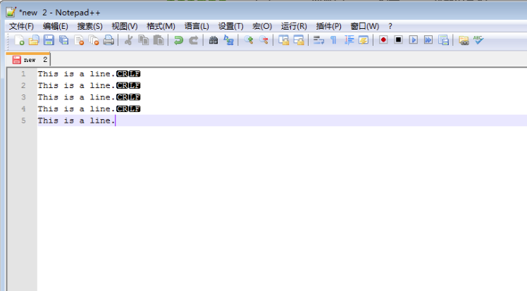
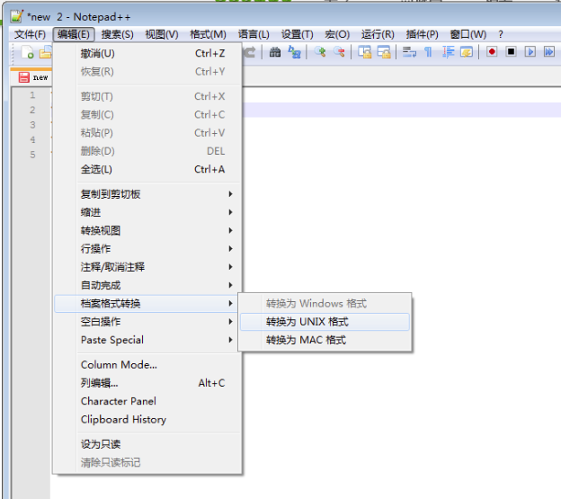
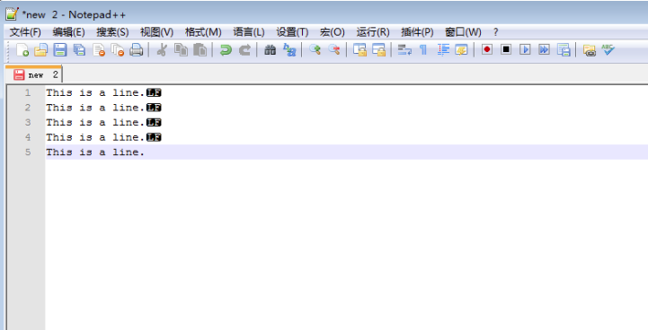
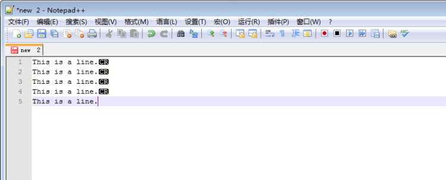

### 回车与换行

#### 概念解释

**换行(line feed)**，从字面意思理解就是另起一行，如在一个定宽的文本编辑器中，当一段文字的尾部到达行尾时我们需要换到下一行继续输入文字。以下是wiki释义:
>换行，是在计算机领域中，换行（newline）或称为Line break或end-of-line（EOL）换行符是一种加在文字最后位置的特殊字符，在换行符的下一个字符将会出现在下一行。

**回车(Carriage return)**，简写为CR，这源于老式打字机的一个设计，以下是wiki释义：
>回车这术语用于打字机的板手。若打字机的语言由左至右书写的语言．回车用于将承载装纸滚筒的机架（carriage）移到最右边，以便令印字位置对准一行的开头，同时顺便转动滚筒，换至下一行。第一个有动力的回车功能是是在1960年由Smith Corona加入电打字机中，此键一般会标示为carriage return或return。

#### 不同平台下字符的表示
在计算机中，**回车符(\r)**和**换行符(\n)**都属于控制字符(或称，非打印字符)，本身并不是一个可写字符。在ASCII码中，**回车符**的值为**0x0A**,**换行符**的置为**0x0D**,由于历史原因，不同平台下在使用换行字符方面存在一些差异，这些差异在跨平台时会导致文字排版的错乱。不同的平台下使用的换行方式分类如下：

+ LF：在Unix或Unix相容系統（GNU/Linux, AIX, Xenix, Mac OS X, ...）、BeOS、Amiga、RISC OS
+ CR+LF：MS-DOS、Microsoft Windows、大部分非Unix的系統
+ CR：Apple II家族，Mac OS至版本9

#### Noteplus中的Line Ending处理

多数的文本编辑器都提供Line Ending的转换处理，用来解决跨平台下文本文件的换行文本，如Windows下的NotePlus。打开NotePlus新建文件并输入几行文本，默认情况下编辑器本身不显示控制字符，如图：

可以通过工具栏上的*视图*>*显示符号*>*显示行尾符*来查看编辑器当前用来处理换行的字符，如图：

设置完成之后，由于是在Windows平台下的文本编辑器，所以显示的换行使用的是**CRLF**,如图

另外，文本编辑器本身也可以了换行符类型的选择，如，在工具栏的*编辑*>*档案格式转换*中，可以看到编辑器支持转换为三种格式的文本类型

+ 转换为Windows格式
+ 转换UNIX格式
+ 转换为MAC格式

如图：

由于是在Windows平台下，所以默认的文本格式为*Windows格式*,我们选择**转换为UNIX格式**,之后可以看到编辑器的换行处理是用**LF**，如图：

也可以选择**转换为MAC格式**，如图

在**转换为MAC格式**后保存文件，并用Windows下的notepad打开该文件，可以看到所有的文本都显示在同一行中。

#### 参考

+ [Windows、Unix、Mac不同操作系统的换行问题-剖析回车符\r和换行符\n](http://blog.csdn.net/tskyfree/article/details/8121951)
+ [如何替换换行符](http://sourceforge.net/p/notepad-plus/discussion/1290589/thread/beb5c565/)
+ [换行](http://zh.wikipedia.org/wiki/%E6%8F%9B%E8%A1%8C)
+ [Control character](http://en.wikipedia.org/wiki/Control_character)
+ [回车和换行](http://www.ruanyifeng.com/blog/2006/04/post_213.html)
