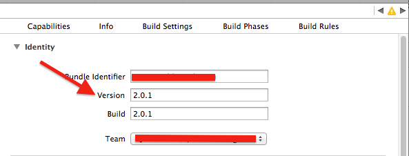

### 关于使用Search API获取App信息进行版本检测

#### IOS版本检测

一般的IOS应用程序在开发时都会在内部添加个新版本检测或提示功能，为的是当应用程序有新的版本发布时，能以最快的速度告之用户升级新的应用程序。虽然在App Store程序的底部**更新**一栏可以提示用户有新版本程序可以更新，但这个有赖于用户自己去打开App Store再点击更新，交互上会多几步，如果用户在使用某个应用程序时，程序会自动提示版本更新并通过一步跳转就到了更新页面，这无意是简化了更新的操作，虽然这种提示有点扰民的嫌疑，但我们通常可以设定提示的间隔来减弱这个影响。

#### Search API简介

[Search API][ref-2]是苹果针对iTunes Store,App Store,iBooks Store和Mac App Store提供的查询接口。使用该查询接口可以查询多种内容的信息，包括：**apps, iBooks, movies, podcasts, music, music videos, audiobooks, and TV shows**，返回的查询信息可根据需要自行使用。搜索接口的全链接格式如下：

	https://itunes.apple.com/search?parameterkeyvalue

`parameterkeyvalue`指待的是查询参数，如`key1=value1&key2=value2&key3=value3`。

此外，[Search API][ref-2]提供了**Lookup**形式的请求，来基于ID进行（_iTunes IDs, UPCs/ EANs, and All Music Guide (AMG) IDs_）查询的方式，这种方式更快更精准。官网示例

	// 查询根据iTunes ID查询Yelp的软件
	https://itunes.apple.com/lookup?id=284910350

有关[Search API][ref-2]更多的接口参数说明，调用说明，请参考苹果的官网的示例。

#### 版本检测的提示的实现方式

进行版本检测的思路也比较直观，首先每个应用程序在创建时，都会为程序分配一个唯一的App ID，应用程序在每个版本正式发布时都会添加并升级一个字符串描述发布版本号`Version`(标准格式是由`'.'`号分割的**数字**组成，例如当前的版本是`1.0.2`，新的版本会在旧的基础上迭，保证下一个版本号从高位到低位都比之前的版本号要高，如新的版本可能是`1.0.3`,或`1.1.2`,再或者是`2.0.0`比`1.0.2`都要高)，这个版本号是配置在 _Info.plist_ 文件中的，其所属key的名称为`CFBundleShortVersionString`，这样首先在程序内部就可以在本地拿到这个`Version`的值。以下是在Xcode5.0版本中的程序target配置图示：

与此同时，苹果提供了[Search API][ref-2]可以方便的根据App ID来获取当前商店里最新版本程序的描述信息，以下是链接地址的格式

	https://itunes.apple.com/lookup?id=App_ID

其中`App_ID`指的就是程序创建时的`Apple ID`。App的描述信息是以JSON格式返回的，其中一项就是的应用程序的`Version`，这样我们可以拿到这个远程的`Version`描述与之前拿到的本地的`Version`描述进行比较，以获取是否由新版本的程序发布，以下是实现代码片段

	// 定义版本检测后的回调
	// newVersion 是否有新版本
	// appInfo app的描述信息
	typedef void (^VersionCheckCallBack)(BOOL newVersion , NSDictionary *appInfo);
	
	static NSOperationQueue *urlConnectionQueue ;

	// Search API的基准链接
	static const NSString *iTunesAppSearchAPILookUpBaseURL = @"https://itunes.apple.com/lookup?id=" ;

	// Apple ID值
	#define APPID @"XXXXX"

	// 获取当前本地的Version
	+ (NSString*)appReleaseVersion
	{
	    return (NSString*)[[NSBundle mainBundle] objectForInfoDictionaryKey:@"CFBundleShortVersionString"];
	}

	// 进行新版本检测
	// callback 版本检测的回调
	+ (void)checkAppIsNewVersion:(VersionCheckCallBack)callback
	{
	    NSString *appInfoLink = [iTunesAppSearchAPILookUpBaseURL stringByAppendingString:APPID];
		
		NSMutableURLRequest *request = [[NSMutableURLRequest alloc] initWithURL:[NSURL URLWithString:appInfoLink]];

		request.HTTPMethod = @"POST";
	    
		if(urlConnectionQueue == nil){
			urlConnectionQueue = [[NSOperationQueue alloc]init] ;
		}		
		
	    [NSURLConnection sendAsynchronousRequest:request	     
	                                       queue:urlConnectionQueue	     
	                           completionHandler:^(NSURLResponse *response, NSData *data, NSError *error) {
	                               
	                               if(!error){
	                                   NSError *jsonParsingError = [NSError new] ;

	                                   if (!data) {
	                                       data = [NSData new];
	                                   }
	                                   NSDictionary *rootObj = [NSJSONSerialization JSONObjectWithData:data
	                                                                                           options:NSJSONReadingAllowFragments
	                                                                                             error:&jsonParsingError] ;
									   // 判断返回结构中是否有值	                                                                                          
	                                   NSNumber *resultCount = (NSNumber*)[rootObj objectForKey:@"resultCount"];
									   
	                                   if ([resultCount integerValue] == 1) {
	                                       
	                                       NSArray *resultList = (NSArray*)[rootObj objectForKey:resultsKeyName];
										   
	                                       if (!resultList || resultList.count ==0) {
	                                           return ;
	                                       }
										   
	                                       NSDictionary *resultItem = (NSDictionary*)[resultList objectAtIndex:0];
	                                       
	                                       NSString *remoteVersion = [resultItem objectForKey:versionKeyName];
	                                       
	                                       NSString *localVersion = [self appReleaseVersion];
	                                       
	                                       BOOL newVersion = NO ;
										   
	                                       // 需要更新
	                                       if ([localVersion compare:remoteVersion] == NSOrderedAscending) {
	                                           newVersion = YES ;
	                                       }
	                                       if(callback){
											   @autoreleasepool {
												   dispatch_async(dispatch_get_main_queue(), ^{
													   
													  callback(newVersion , rootObj);
												   });
											   }
	                                           
	                                       }                                   
	                                   }	                                   
	                               }	                               
	                           }]; // sendAsynchronousRequest end
	}

这样通过调用`checkAppIsNewVersion`方法，结合`VersionCheckCallBack`回调，就完成了版本检测的基本过程，具体的提示显示可根据情况来定。

#### 关于Search API地址的问题

关于[Search API][ref-2]的基准链接有一点要注意的是，如果应用程序的发布国家不包含美国，那么在拼接最终的链接地址时，地址后面需要添加一个名为`country`的查询参数，该参数的值为应用程序发布国家的**ISO country码**,例如，美国地区的为`us`，中国地区的为`cn`,具体标识列表参见[ISO Country Codes][ref-4]中的说明。默认`country=us`,如果你的应用程序不在美国上架发布的话，忽略该参数会导致上一步描述的版本检测查询获取app的描述信息返回为空，也就是代码行中

	NSNumber *resultCount = (NSNumber*)[rootObj objectForKey:@"resultCount"];

中的`resultCount`的返回值为`0`	,这样虽然你的app已上架发布，但版本检测的功能等于是无法使用的，这是程序的bug。因此如果程序只在特定的地区上架，那么查询接口的格式如下

	https://itunes.apple.com/lookup?id=xxxxxx&country=xx

请不要将应用程序支持的语言与上架地区混淆，只支持中文的应用也可以在美国上架，例如iPhone版的QQ支持中文，但同样可以在美国地区上架，所以可以忽略`country`参数。

#### 参考

+ [Link Maker][ref-1]
+ [Search API][ref-2]
+ [appirater][ref-3]
+ [ISO Country Codes][ref-4]

[ref-1]: http://linkmaker.itunes.apple.com/cn
[ref-2]: https://www.apple.com/itunes/affiliates/resources/documentation/itunes-store-web-service-search-api.html
[ref-3]: https://github.com/arashpayan/appirater
[ref-4]: http://en.wikipedia.org/wiki/ISO_3166-1_alpha-2
