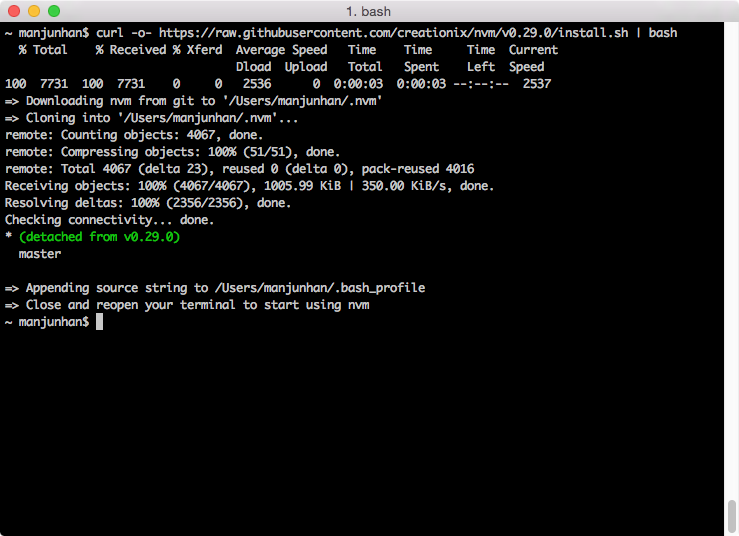

###Mac OS X下使用NVM管理node.js版本

nvm全称Node Version Manager，是一个简单的脚本工具，用来在单机管理多个版本的Node.js。Node.js作为当下比较新的web应用开发可选技术，允许程序员使用javascript语言来编写前后端代码。新的技术意味着需要不断的迭代完善，每次迭代带来新版本的升级和新功能的加入，因此实际具体的应用，会面临Node.js版本的升级或者多版本之间进行必要的切换。如果平滑的进行Node.js版本升级，以及管理多版本的Node.js则变成了一个问题，nvm则是为了解决该问题。

###安装

nvm依赖于C++的编译器，对于Mac OS X来说，使用XCode的Common Line Tools即可，此处省略具体的安装步骤。打开终端，在命令行下输入

	curl -o- https://raw.githubusercontent.com/creationix/nvm/v0.29.0/install.sh | bash
	
会下载并安装nvm，其中路径中的`v0.29.0`为nvm的版本号，安装最新版本的nvm只要更新路径中的版本信息即可，nvm的版本可见其[Release Notes][3]。

>以上的安装脚本会复制nvm的repository到当前的用户主目录下的`.nvm`目录下(`~/.nvm`),并将 source line添加到profile文件中（根据不同的shell类型，有可能是`~/.bash_profile`,`~/.zshrc`,`~/.profile`），

我本机的profile为`~/.bash_profile`。根据安装提示**Close and reopen your terminal to start using nvm**,我们需要关闭并重启终端才能使用nvm。也可以使用`source`命令更新`~/.bash_profile`使新配置生效,即运行一下命令

	$ source ~/.bash_profile
	
之后就可以使用nvm了。验证nvm是否安装成功，可以在终端输入

	$ nvm --version
	0.29.0
	
###使用

1. 查看nvm的帮助

		$ nvm help
		
		Node Version Manager

		Note: <version> refers to any version-like string nvm understands. This includes:
		  - full or partial version numbers, starting with an optional "v" (0.10, v0.1.2, v1)
		  - default (built-in) aliases: node, stable, unstable, iojs, system
		  - custom aliases you define with `nvm alias foo`

		Usage:
		  nvm help                                  Show this message
		  nvm --version                             Print out the latest released version of nvm
		  nvm install [-s] <version>                Download and install a <version>, [-s] from source. Uses .nvmrc if available
		    --reinstall-packages-from=<version>     When installing, reinstall packages installed in <node|iojs|node version number>
		  nvm uninstall <version>                   Uninstall a version
		  nvm use [--silent] <version>              Modify PATH to use <version>. Uses .nvmrc if available
		  nvm exec [--silent] <version> [<command>] Run <command> on <version>. Uses .nvmrc if available
		  nvm run [--silent] <version> [<args>]     Run `node` on <version> with <args> as arguments. Uses .nvmrc if available
		  nvm current                               Display currently activated version
		  nvm ls                                    List installed versions
		  nvm ls <version>                          List versions matching a given description
		  nvm ls-remote                             List remote versions available for install
		  nvm version <version>                     Resolve the given description to a single local version
		  nvm version-remote <version>              Resolve the given description to a single remote version
		  nvm deactivate                            Undo effects of `nvm` on current shell
		  nvm alias [<pattern>]                     Show all aliases beginning with <pattern>
		  nvm alias <name> <version>                Set an alias named <name> pointing to <version>
		  nvm unalias <name>                        Deletes the alias named <name>
		  nvm reinstall-packages <version>          Reinstall global `npm` packages contained in <version> to current version
		  nvm unload                                Unload `nvm` from shell
		  nvm which [<version>]                     Display path to installed node version. Uses .nvmrc if available

		Example:
		  nvm install v0.10.32                  Install a specific version number
		  nvm use 0.10                          Use the latest available 0.10.x release
		  nvm run 0.10.32 app.js                Run app.js using node v0.10.32
		  nvm exec 0.10.32 node app.js          Run `node app.js` with the PATH pointing to node v0.10.32
		  nvm alias default 0.10.32             Set default node version on a shell

		Note:
		  to remove, delete, or uninstall nvm - just remove the `$NVM_DIR` folder (usually `~/.nvm`)

2. 安装最新稳定版本的Node.js

		$ nvm install stable
		Downloading https://nodejs.org/dist/v4.2.0/node-v4.2.0-darwin-x64.tar.gz...
		######################################################################## 100.0%
		WARNING: checksums are currently disabled for node.js v4.0 and later
		Now using node v4.2.0 (npm v2.14.7)

3. 安装指定版本的Node.js

		$ nvm install 0.12.7
		
4. 切换使用指定版本号的Node.js		

		$ nvm use 0.12.7
5. 查看当前所使用的Node.js的版本

		$ nvm current	
			
6. 查看指定版本Node.js的路径		

		$ nvm which 0.12.7

7. 列出当前本地安装的所有Node.js的版本

		$ nvm ls

8. 列出远程Node.js的所有版本列表

		$ nvm ls-remote
		
9. 切换到系统安装的Node.js

		$ nvm use system

10. 恢复使用`PATH`变量指定的node（通常是使用安装包安装的node版本）

		$ nvm deactivate
		
11. 为所有打开的终端设置默认的node版本

		$ nvm alias default 0.12.7

10. 卸载指定版本的Node.js

		$ nvm uninstall 0.12.7
		
11. 卸载nvm命令

		$ nvm unload
		
12. 重新激活nvm命令

		$ source ~./bash_profile	
			
	> nvm并不是一个命令文件，只是一个函数集合，使用`source`命令可以将这些函数重新读入到当前shell的环境中，也可以使用`source ~/.nvm/nvm.sh`。

13. 使用_.nvmrc_文件

	在项目的根目录下可以创建名为_.nvmrc_的文件，并写入当前项目依赖的Node.js的版本号，之后在终端切换到项目根目录，运行`nvm use`,`nvm install`, `nvm exec`, `nvm run`, `nvm which`都会使用文件中指定版本的Node.js,如果本机不存在则会给出不存在的提示。如查看本机使用的Node.js版本
	
		$ nvm current
		v4.2.0
		
	新建`test-app`目录，并在该目录下新建名为`.nvmrc`的文件,写入指定版本号，并运行`nvm use`,重新查看当前使用的Node.js版本
		
		$ mkdir test-app
		$ cd test-app
		$ touch .nvmrc
		$ vim .nvmrc  ## 写入0.12.6
		$ nvm use
		Found '/Users/manjunhan/Desktop/test-app/.nvmrc' with version <0.12.6>
		Now using node v0.12.6 (npm v2.11.2)
		$ nvm current
		0.12.6
		
	当项目分发给别人运行时，只要在安装了nvm并在项目根目录下运行`nvm install`即可将当前机器的Node.js版本切换到适合当前项目的版本。
	
###卸载nvm

1. 打开`~/.bash_profile`,清除以下代码行

		export NVM_DIR="/Users/manjunhan/.nvm"
		[ -s "$NVM_DIR/nvm.sh" ] && . "$NVM_DIR/nvm.sh"  # This loads nvm
		
2. 删除`~/.nvm`目录		

		$ cd ~
		$ rm -dfr .nvm		
	
	
		

###参考

+ [NVM Github][1]
+ [NVM Release notes][3]
+ [How To Install Node.js with NVM (Node Version Manager) on a VPS][2]
+ [“which nvm” is gone][4]
+ [Node.js Previous Releases][5]
+ [source ：读入环境配置文件的命令][6]
+ [Xcode Command Line Tools][7]
+ [GCC][8]
+ [How can I update Node.js and NPM to the next versions?][9]

[1]: https://github.com/creationix/nvm
[2]: https://www.digitalocean.com/community/tutorials/how-to-install-node-js-with-nvm-node-version-manager-on-a-vps
[3]: https://github.com/creationix/nvm/releases
[4]: http://stackoverflow.com/questions/19131781/which-nvm-is-gone
[5]: https://nodejs.org/en/download/releases/
[6]: http://vbird.dic.ksu.edu.tw/linux_basic/0320bash_4.php#source
[7]: http://railsapps.github.io/xcode-command-line-tools.html
[8]: https://zh.wikipedia.org/wiki/GCC
[9]: http://stackoverflow.com/questions/6237295/how-can-i-update-node-js-and-npm-to-the-next-versions?rq=1
