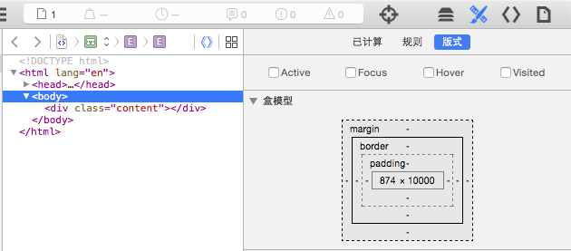

iOS Safari上禁止body滚动

在CSS中，`overflow`属性可以用来控制当内容超出块级父容器时的效果。
可以截断内容：
	
	overflow:hidden;
	
可以显示内容：
	
	overflow:visible;
	
也可以渲染滚动条，滚动显示需要看到的内容：

	overflow:scroll;
	
或者由浏览器自己决定

	overflow:auto ;
	
在桌面浏览器中禁用`body`滚动可以直接添加`overflow:hidden`即可，如

	body{
		overflow:hidden;
	}
	
	.content{
		height:10000px; /*使得内容超出body视口区*/
	}
	
	<body>
		

	</body>
	
但在iOS safari浏览器（iOS8.3测试）中该方法无法达到预期效果，当`content`的内容高度超出`body`高度时，依然显示滚动条。细看`overflow`属性的说明，它的使用其实是要满足一定的条件的：

1. 只适用于HTML的_非替换block元素_和_非替换inline-block元素_
2. 使用`overflow`属性的元素必须要有一个固定的高度(指定`height`或`max-height`属性)，或者设置`white-space:nowrap`

根据以上限定条件直观理解也是可以明白的，是否有内容溢出不但要看内容的实际尺寸，也要看父容器的尺寸，这样才有可比较性和相对性。

以以上测试代码为例，在桌面的safari下根据运行结果，虽然没有为`body`设置固定的高度，但实际的运行效果是`body`的高度为`content`的高度，如：

按照直观的感觉，既然`body`的高度与`content`的高度相等，内容的截断与否应该由`body`的包容器决定，也就是由`html`元素决定,继续查看`html`的盒模型，发现`html`的高度与`body`和`content`也是一致的

+ [Overflow:hidden not working on mobile browser][1]
+ [Does overflow:hidden applied to <body> work on iPhone Safari?]

[1]: http://stackoverflow.com/questions/18268300/overflowhidden-not-working-on-mobile-browser
[2]: http://stackoverflow.com/questions/3047337/does-overflowhidden-applied-to-body-work-on-iphone-safari